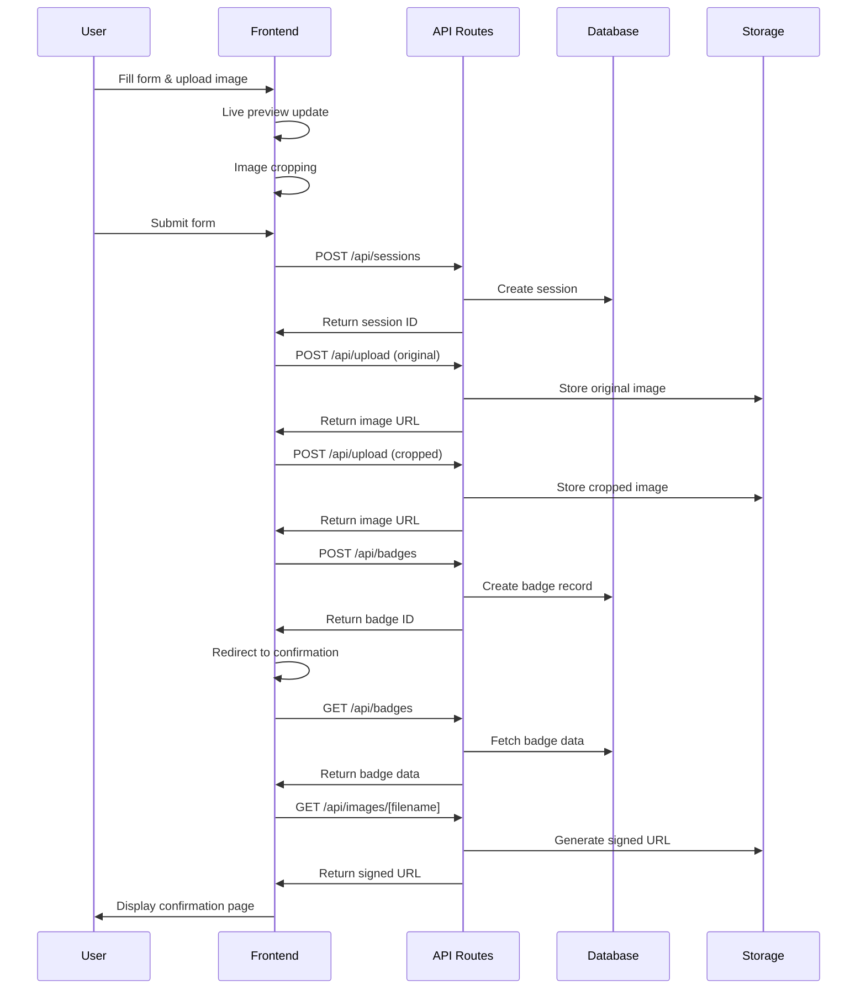
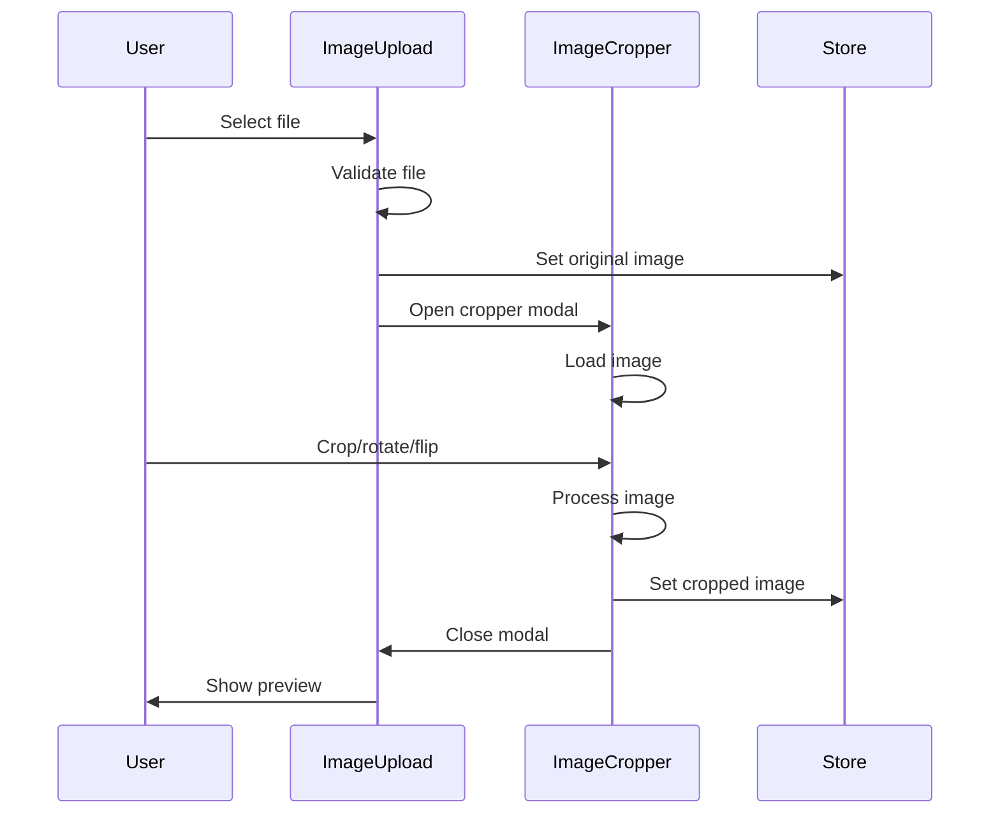

# Badge Maker - System Architecture

## PROJECT STATUS: PRODUCTION READY ✅

**Last Updated**: December 2024  
**Status**: 100% Complete - All architectural components implemented and tested  
**Version**: 2.0.0

---

## 🏗 **System Overview**

The Badge Maker is built on a modern, scalable architecture using Next.js 14 with App Router, TypeScript, and Supabase. The system follows atomic design principles and implements a secure, responsive web application for complete event management including digital waiver signing, PDF generation, and personalized badge creation.

## 🎯 **Architecture Principles**

### **Design Patterns**
- **Atomic Design**: Component-based architecture with atoms, molecules, organisms, templates, and pages
- **Server Components**: Next.js 14 App Router with server and client components
- **State Management**: Zustand for global state with React Hook Form for local form state
- **Type Safety**: Full TypeScript implementation throughout the application

### **Security First**
- **Private Storage**: All images stored in private Supabase bucket
- **Signed URLs**: Temporary, secure access to images with expiration
- **Row Level Security**: Database-level access control
- **Input Validation**: Comprehensive validation on client and server

### **Performance Optimized**
- **Image Processing**: Optimized cropping and compression
- **Lazy Loading**: Component-level code splitting
- **Efficient State**: Minimal re-renders with Zustand
- **Bundle Optimization**: Tree shaking and minimal dependencies

---

## 🏛 **System Architecture**

```
┌─────────────────────────────────────────────────────────────┐
│                    Frontend (Next.js 14)                    │
├─────────────────────────────────────────────────────────────┤
│  ┌─────────────┐  ┌─────────────┐  ┌─────────────┐         │
│  │   Pages     │  │ Components  │  │    Hooks    │         │
│  │             │  │             │  │             │         │
│  │ • Landing   │  │ • Atoms     │  │ • useBadge  │         │
│  │ • Waiver    │  │ • Molecules │  │   Store     │         │
│  │ • Badge     │  │ • Organisms │  │ • useUser   │         │
│  │ • Confirma- │  │ • Templates │  │   Flow      │         │
│  │   tion      │  │             │  │   Store     │         │
│  └─────────────┘  └─────────────┘  └─────────────┘         │
├─────────────────────────────────────────────────────────────┤
│                    API Routes (Next.js)                     │
│  ┌─────────────┐  ┌─────────────┐  ┌─────────────┐         │
│  │   /api/     │  │   /api/     │  │   /api/     │         │
│  │  badges     │  │   upload    │  │  sessions   │         │
│  └─────────────┘  └─────────────┘  └─────────────┘         │
│  ┌─────────────┐  ┌─────────────┐  ┌─────────────┐         │
│  │   /api/     │  │   /api/     │  │   /api/     │         │
│  │  images/    │  │    test     │  │    pdf      │         │
│  │ [filename]  │  │             │  │             │         │
│  └─────────────┘  └─────────────┘  └─────────────┘         │
│  ┌─────────────┐  ┌─────────────┐                          │
│  │   /api/     │  │   /api/     │                          │
│  │   email     │  │             │                          │
│  └─────────────┘  └─────────────┘                          │
├─────────────────────────────────────────────────────────────┤
│                    Backend (Supabase)                       │
│  ┌─────────────┐  ┌─────────────┐  ┌─────────────┐         │
│  │  Database   │  │   Storage   │  │     RLS     │         │
│  │             │  │             │  │             │         │
│  │ • sessions  │  │ • badge-    │  │ • Policies  │         │
│  │ • badges    │  │   images    │  │ • Access    │         │
│  │ • waivers   │  │ • waiver-   │  │   Control   │         │
│  │ • templates │  │   documents │  │             │         │
│  │ • analytics │  │ • original/ │  │             │         │
│  │             │  │ • cropped/  │  │             │         │
│  └─────────────┘  └─────────────┘  └─────────────┘         │
├─────────────────────────────────────────────────────────────┤
│                  External Services                          │
│  ┌─────────────┐  ┌─────────────┐                          │
│  │  Puppeteer  │  │  Postmark   │                          │
│  │   PDF Gen   │  │   Email     │                          │
│  └─────────────┘  └─────────────┘                          │
└─────────────────────────────────────────────────────────────┘
```

---

## 🎨 **Frontend Architecture**

### **Component Hierarchy**

```
src/
├── app/                          # Next.js App Router
│   ├── api/                     # API Routes (8 endpoints)
│   ├── landing/                 # Landing page
│   ├── waiver/                  # Waiver signing page
│   ├── badge/                   # Badge creation page
│   ├── confirmation/            # Confirmation page
│   ├── test/                    # Test page
│   ├── globals.css              # Global styles
│   ├── layout.tsx               # Root layout
│   └── page.tsx                 # Home page
├── components/                  # Atomic Design Components
│   ├── atoms/                   # Basic building blocks
│   │   ├── button.tsx          # Button component
│   │   ├── card.tsx            # Card component
│   │   ├── input.tsx           # Input component
│   │   ├── label.tsx           # Label component
│   │   ├── select.tsx          # Select component
│   │   └── index.ts            # Export barrel
│   ├── molecules/               # Composite components
│   │   ├── ImageUpload.tsx     # Image upload with cropper
│   │   ├── SocialMediaInput.tsx # Social media handles
│   │   ├── DateOfBirthInput.tsx # Date picker component
│   │   ├── DietaryAndVolunteeringForm.tsx # Preferences form
│   │   └── SignatureCapture.tsx # Digital signature capture
│   │   └── index.ts            # Export barrel
│   ├── organisms/               # Complex components
│   │   ├── BadgeCreationForm.tsx # Main form component
│   │   ├── BadgePreview.tsx    # Live badge preview
│   │   └── index.ts            # Export barrel
│   ├── pages/                   # Page-level components
│   │   ├── BadgeCreationPage.tsx # Badge creation page
│   │   ├── ConfirmationPage.tsx # Confirmation page
│   │   └── index.ts            # Export barrel
│   ├── templates/               # Layout templates
│   │   ├── BadgeMakerTemplate.tsx # Main layout
│   │   ├── ConfirmationTemplate.tsx # Confirmation layout
│   │   └── index.ts            # Export barrel
│   └── index.ts                 # Main export
├── hooks/                       # Custom React hooks
│   └── useBadgeStore.ts        # Zustand store
├── lib/                         # Utility functions
│   ├── supabase.ts             # Supabase client
│   └── utils/                   # Utility functions
│       ├── imageUtils.ts       # Image handling utilities
│       └── utils.ts            # General utilities
└── types/                       # TypeScript definitions
    └── badge.ts                # Badge-related types
```

### **State Management**

#### **Zustand Store (useBadgeStore)**
```typescript
interface BadgeStore {
  // Form data
  data: BadgeData
  
  // Image files
  originalImage: File | null
  croppedImage: File | null
  
  // Crop data
  cropData: CropData | null
  
  // Actions
  setData: (data: Partial<BadgeData>) => void
  setOriginalImage: (file: File | null) => void
  setCroppedImage: (file: File | null) => void
  setCropData: (data: CropData | null) => void
  reset: () => void
}
```

#### **Form State (React Hook Form)**
```typescript
interface BadgeFormData {
  badge_name: string
  email: string
  social_media_handles: SocialMediaHandle[]
}
```

### **Data Flow**

1. **User Input** → **React Hook Form** → **Zustand Store** → **Live Preview**
2. **Image Upload** → **File Validation** → **Cropper Modal** → **Store Update**
3. **Form Submission** → **API Routes** → **Supabase** → **Confirmation Page**

---

## 🔌 **Backend Architecture**

### **API Routes Structure**

```
src/app/api/
├── badges/
│   └── route.ts                # POST/GET badge operations
├── upload/
│   └── route.ts                # POST image upload
├── sessions/
│   └── route.ts                # POST/GET session operations
├── images/
│   └── [filename]/
│       └── route.ts            # GET signed URL generation
└── test/
    └── route.ts                # GET diagnostic endpoint
```

### **Database Schema**

#### **Sessions Table**
```sql
CREATE TABLE sessions (
  id UUID PRIMARY KEY DEFAULT gen_random_uuid(),
  created_at TIMESTAMP WITH TIME ZONE DEFAULT NOW(),
  expires_at TIMESTAMP WITH TIME ZONE DEFAULT (NOW() + INTERVAL '24 hours')
);
```

#### **Badges Table**
```sql
CREATE TABLE badges (
  id UUID PRIMARY KEY DEFAULT gen_random_uuid(),
  session_id UUID REFERENCES sessions(id),
  badge_name TEXT NOT NULL,
  email TEXT NOT NULL,
  social_media_handles JSONB NOT NULL,
  original_image_url TEXT,
  cropped_image_url TEXT,
  crop_data JSONB,
  created_at TIMESTAMP WITH TIME ZONE DEFAULT NOW()
);
```

#### **Templates Table**
```sql
CREATE TABLE templates (
  id UUID PRIMARY KEY DEFAULT gen_random_uuid(),
  name TEXT NOT NULL,
  description TEXT,
  created_at TIMESTAMP WITH TIME ZONE DEFAULT NOW()
);
```

#### **Analytics Table**
```sql
CREATE TABLE analytics (
  id UUID PRIMARY KEY DEFAULT gen_random_uuid(),
  event_type TEXT NOT NULL,
  event_data JSONB,
  created_at TIMESTAMP WITH TIME ZONE DEFAULT NOW()
);
```

### **Storage Architecture**

#### **Supabase Storage Bucket**
```
badge-images/ (private bucket)
├── original/                   # Original uploaded images
│   ├── session_id_1/
│   │   ├── image_1.jpg
│   │   └── image_2.png
│   └── session_id_2/
│       └── image_3.webp
└── cropped/                    # Processed cropped images
    ├── session_id_1/
    │   ├── image_1_cropped.jpg
    │   └── image_2_cropped.png
    └── session_id_2/
        └── image_3_cropped.webp
```

### **Security Implementation**

#### **Row Level Security (RLS)**
```sql
-- Sessions table policies
CREATE POLICY "Sessions are accessible by session ID" ON sessions
  FOR ALL USING (id = current_setting('app.session_id', true)::uuid);

-- Badges table policies
CREATE POLICY "Badges are accessible by session ID" ON badges
  FOR ALL USING (session_id = current_setting('app.session_id', true)::uuid);

-- Storage policies
CREATE POLICY "Images are accessible by session" ON storage.objects
  FOR SELECT USING (bucket_id = 'badge-images' AND 
                   (storage.foldername(name))[1] = current_setting('app.session_id', true));
```

#### **Signed URL System**
- **Temporary Access**: 1-hour expiration for image URLs
- **Secure Generation**: Server-side URL signing
- **No Public Access**: All images require signed URLs

---

## 🔄 **Data Flow Architecture**

### **Badge Creation Flow**



### **Image Processing Flow**



---

## 🎨 **Design System Architecture**

### **Typography Scale**
```css
/* Font Families */
.font-montserrat { font-family: 'Montserrat', sans-serif; }
.font-open-sans { font-family: 'Open Sans', sans-serif; }

/* Responsive Text Sizes */
.text-[64px] sm:text-[48px]    /* Title */
.text-[48px] sm:text-[32px]    /* Badge name */
.text-[32px] sm:text-[20px]    /* Social handles */
.text-[16px]                   /* Form labels */
.text-[14px]                   /* Helper text */
```

### **Color System**
```css
/* Primary Colors */
--badge-bg: #ffcc00;           /* Badge background */
--main-bg: #2d2d2d;            /* Main background */
--card-bg: #111111;            /* Card background */

/* Text Colors */
--text-primary: #ffffff;       /* Primary text */
--text-muted: #949494;         /* Muted text */

/* Border Colors */
--border-input: #5c5c5c;       /* Input borders */
--border-button: #c0c0c0;      /* Button borders */
```

### **Spacing System**
```css
/* Consistent Heights */
.h-[41px]                      /* All form elements */

/* Gap System */
.gap-[5px]                     /* Form element gaps */
.gap-[30px]                    /* Badge preview gaps */
.gap-[18px] sm:gap-[12px]      /* Social media gaps */

/* Padding System */
.p-[50px_40px] sm:p-[30px_20px] /* Badge container */
```

---

## 📱 **Responsive Architecture**

### **Breakpoint Strategy**
```css
/* Mobile First Approach */
/* Base styles for mobile */
.badge-container {
  width: 350px;
  height: auto;
  min-height: 600px;
}

/* Desktop styles */
@media (min-width: 640px) {
  .badge-container {
    width: 587px;
    height: 983px;
  }
}
```

### **Component Responsiveness**
- **BadgePreview**: Scales from 350px to 587px width
- **Form Layout**: Single column on mobile, two columns on desktop
- **Typography**: Responsive text sizing
- **Spacing**: Reduced gaps and padding on mobile

---

## 🔒 **Security Architecture**

### **Input Validation**
```typescript
// Client-side validation (Zod)
const badgeSchema = z.object({
  badge_name: z.string().min(1, 'Badge name is required'),
  email: z.string().email('Please enter a valid email'),
  social_media_handles: z.array(z.object({
    platform: z.enum(['none', 'x', 'bluesky', 'telegram', 'recon', 'furaffinity', 'fetlife', 'discord', 'instagram', 'other']),
    handle: z.string().min(1, 'Handle is required')
  })).max(3, 'Maximum 3 social media handles allowed')
});

// Server-side validation
const validateFile = (file: File) => {
  const allowedTypes = ['image/jpeg', 'image/jpg', 'image/png', 'image/webp', 'image/gif'];
  const maxSize = 5 * 1024 * 1024; // 5MB
  const minSize = 10 * 1024; // 10KB
  
  return allowedTypes.includes(file.type) && 
         file.size <= maxSize && 
         file.size >= minSize;
};
```

### **Image Security**
- **Private Storage**: No public access to uploaded images
- **Signed URLs**: Temporary access with 1-hour expiration
- **File Validation**: Type, size, and content validation
- **Secure Upload**: Server-side file processing

### **Waiver System Security**
- **Digital Signatures**: Legally binding signature capture with validation
- **Audit Trail**: IP address, user agent, and timestamp tracking
- **PDF Generation**: Server-side generation for consistency and security
- **Email Verification**: Secure email delivery with PDF attachments
- **Data Privacy**: Sensitive information protected with RLS policies

---

## 🚀 **Performance Architecture**

### **Optimization Strategies**
- **Image Processing**: Optimized cropping and compression
- **Lazy Loading**: Component-level code splitting
- **State Management**: Minimal re-renders with Zustand
- **Bundle Optimization**: Tree shaking and minimal dependencies

### **Caching Strategy**
- **Browser Caching**: Static assets and components
- **API Caching**: Short-term caching for signed URLs
- **Image Caching**: Optimized image delivery

---

## 🔧 **Development Architecture**

### **Development Workflow**
1. **Local Development**: Next.js dev server with hot reload
2. **Type Checking**: TypeScript compilation and linting
3. **Code Quality**: ESLint and Prettier enforcement
4. **Testing**: Manual testing of all user flows
5. **Documentation**: Comprehensive markdown documentation

### **Environment Management**
```typescript
// Environment variables
NEXT_PUBLIC_SUPABASE_URL=your_supabase_url
NEXT_PUBLIC_SUPABASE_ANON_KEY=your_anon_key
SUPABASE_SERVICE_ROLE_KEY=your_service_role_key
POSTMARK_API_KEY=your_postmark_api_key
POSTMARK_FROM_EMAIL=noreply@yourdomain.com
NEXT_PUBLIC_APP_URL=http://localhost:3000
WAIVER_VERSION=1.0.0
```

---

## 📈 **Scalability Architecture**

### **Horizontal Scaling**
- **Stateless API**: API routes can be scaled horizontally
- **Database Scaling**: Supabase handles database scaling
- **Storage Scaling**: Supabase Storage scales automatically

### **Future Enhancements**
- **CDN Integration**: Global image delivery
- **Redis Caching**: Session and data caching
- **Microservices**: Separate services for different features
- **Load Balancing**: Multiple server instances

---

## 🎉 **Architecture Success**

The Badge Maker architecture successfully demonstrates:

- **Modern Stack**: Latest technologies and best practices
- **Scalable Design**: Built for growth and enhancement
- **Security Focus**: Comprehensive security measures
- **Performance**: Optimized for speed and efficiency
- **Maintainability**: Clean, documented codebase
- **User Experience**: Responsive and intuitive design
- **Complete Workflow**: End-to-end event management solution
- **Legal Compliance**: Digital waiver system with audit trails

**Status**: ✅ **100% COMPLETE** - Production-ready architecture with waiver system  
**Ready for**: Production deployment and future enhancements
