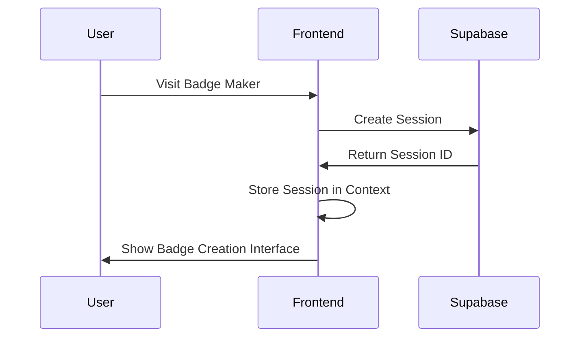
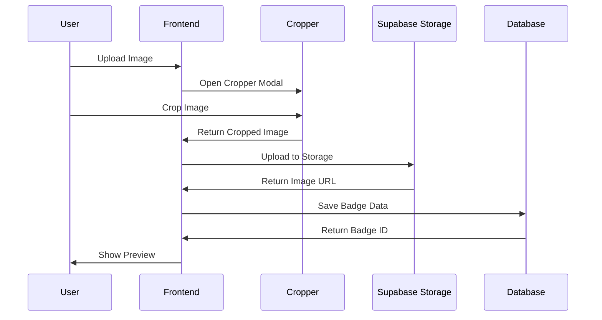
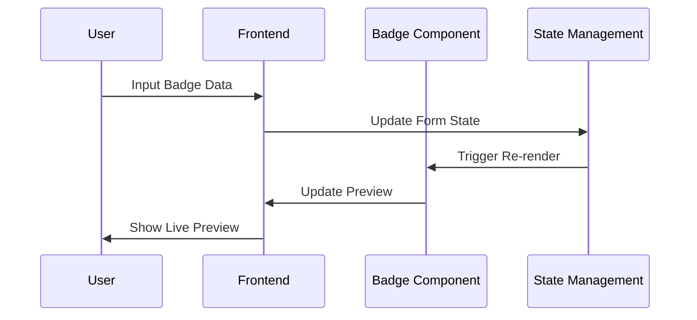

# Badge Maker - Architecture Documentation

## 🏗 System Architecture

### Overview

The Badge Maker application follows a modern web architecture with Next.js 14 App Router, Supabase as the backend-as-a-service, and a component-driven frontend using shadcn/ui.

### Architecture Diagram

```
┌─────────────────┐    ┌─────────────────┐    ┌─────────────────┐
│   Frontend      │    │   Next.js API   │    │   Supabase      │
│   (Next.js)     │◄──►│   Routes        │◄──►│   Backend       │
│                 │    │                 │    │                 │
│ ┌─────────────┐ │    │ ┌─────────────┐ │    │ ┌─────────────┐ │
│ │   React     │ │    │ │   Auth      │ │    │ │   Database  │ │
│ │ Components  │ │    │ │   Badge     │ │    │ │   (PostgreSQL)│ │
│ └─────────────┘ │    │ │   Storage   │ │    │ └─────────────┘ │
│ ┌─────────────┐ │    │ └─────────────┘ │    │ ┌─────────────┐ │
│ │   shadcn/ui │ │    │                 │    │ │   Auth      │ │
│ │ Components  │ │    │                 │    │ │   Service   │ │
│ └─────────────┘ │    │                 │    │ └─────────────┘ │
│ ┌─────────────┐ │    │                 │    │ ┌─────────────┐ │
│ │   React     │ │    │                 │    │ │   Storage   │ │
│ │ Advanced    │ │    │                 │    │ │   Service   │ │
│ │ Cropper     │ │    │                 │    │ └─────────────┘ │
│ └─────────────┘ │    │                 │    └─────────────────┘
└─────────────────┘    └─────────────────┘
```

## 📊 Data Flow

### 1. Session Creation Flow



### 2. Badge Creation Flow



### 3. Badge Preview Flow



## 🗄 Database Schema

### Tables

#### sessions
```sql
CREATE TABLE sessions (
  id UUID PRIMARY KEY DEFAULT uuid_generate_v4(),
  session_data JSONB DEFAULT '{}',
  created_at TIMESTAMP WITH TIME ZONE DEFAULT NOW(),
  expires_at TIMESTAMP WITH TIME ZONE DEFAULT (NOW() + INTERVAL '2 hours')
);
```

#### badges
```sql
CREATE TABLE badges (
  id UUID PRIMARY KEY DEFAULT gen_random_uuid(),
  user_id UUID REFERENCES users(id) ON DELETE CASCADE,
  template_id TEXT NOT NULL,
  name TEXT NOT NULL,
  title TEXT,
  company TEXT,
  email TEXT,
  phone TEXT,
  image_url TEXT,
  badge_data JSONB NOT NULL,
  is_public BOOLEAN DEFAULT false,
  created_at TIMESTAMP WITH TIME ZONE DEFAULT NOW(),
  updated_at TIMESTAMP WITH TIME ZONE DEFAULT NOW()
);
```

#### templates
```sql
CREATE TABLE templates (
  id TEXT PRIMARY KEY,
  name TEXT NOT NULL,
  description TEXT,
  preview_url TEXT,
  config JSONB NOT NULL,
  is_active BOOLEAN DEFAULT true,
  created_at TIMESTAMP WITH TIME ZONE DEFAULT NOW()
);
```

## 🧩 Component Architecture

### Component Hierarchy

```
App
├── Layout
│   ├── Header
│   ├── Sidebar
│   └── Footer
├── AuthProvider
├── Routes
│   ├── Dashboard
│   │   ├── BadgeList
│   │   └── BadgeCard
│   ├── Create
│   │   ├── BadgeForm
│   │   ├── BadgePreview
│   │   └── ImageCropper
│   └── Profile
└── Modals
    ├── ImageCropperModal
    └── ExportModal
```

### Key Components

#### 1. BadgeForm
- **Purpose**: Collects user input for badge information
- **Props**: `onChange`, `initialData`, `template`
- **State**: Form data, validation errors
- **Dependencies**: React Hook Form, shadcn/ui components

#### 2. BadgePreview
- **Purpose**: Renders live preview of badge
- **Props**: `badgeData`, `template`, `imageUrl`
- **State**: Preview dimensions, zoom level
- **Dependencies**: Canvas API, badge templates

#### 3. ImageCropper
- **Purpose**: Handles image upload and cropping
- **Props**: `onCropComplete`, `aspectRatio`
- **State**: Upload progress, crop coordinates
- **Dependencies**: React Advanced Cropper

#### 4. BadgeTemplate
- **Purpose**: Defines badge layout and styling
- **Props**: `data`, `dimensions`
- **State**: Template configuration
- **Dependencies**: CSS-in-JS, responsive design

## 🔐 Security Considerations

### Authentication
- Supabase Auth with JWT tokens
- Session management with secure cookies
- Role-based access control (RBAC)

### Data Protection
- Input validation and sanitization
- SQL injection prevention (Supabase handles this)
- XSS protection with Content Security Policy

### File Upload Security
- File type validation
- File size limits
- Virus scanning (if required)
- Secure file storage with signed URLs

## 🚀 Performance Optimization

### Frontend
- Code splitting with Next.js dynamic imports
- Image optimization with Next.js Image component
- Lazy loading for non-critical components
- Memoization for expensive computations

### Backend
- Database indexing on frequently queried fields
- Connection pooling with Supabase
- Caching strategies for static data
- CDN for static assets

## 📱 Responsive Design

### Breakpoints
- Mobile: 320px - 768px
- Tablet: 768px - 1024px
- Desktop: 1024px+

### Mobile Considerations
- Touch-friendly interface
- Simplified navigation
- Optimized image cropping for touch
- Reduced feature set for mobile

## 🔧 Development Workflow

### Code Organization
- Feature-based folder structure
- Shared components in `/components/ui`
- Custom hooks in `/hooks`
- Type definitions in `/types`
- Utility functions in `/lib`

### State Management
- Local state with React hooks
- Form state with React Hook Form
- Global state with Zustand (if needed)
- Server state with Supabase client

### Testing Strategy
- Unit tests for utility functions
- Component tests with React Testing Library
- Integration tests for API routes
- E2E tests with Playwright

## 🚀 Deployment

### Environment Setup
- Development: Local with Supabase local
- Staging: Vercel + Supabase staging
- Production: Vercel + Supabase production

### CI/CD Pipeline
- GitHub Actions for automated testing
- Vercel for automatic deployments
- Supabase migrations for database changes

## 📈 Monitoring & Analytics

### Error Tracking
- Sentry for error monitoring
- Supabase logs for backend errors
- Vercel analytics for performance

### User Analytics
- Google Analytics for user behavior
- Custom events for feature usage
- Performance monitoring with Core Web Vitals
