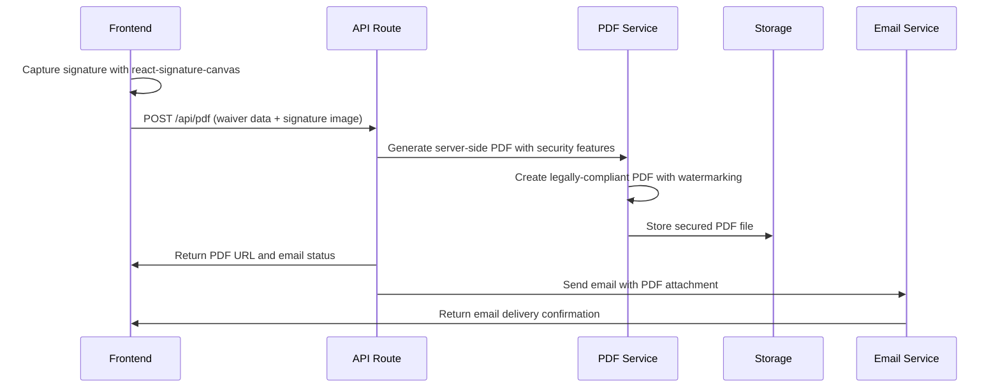

# Badge Maker - Waiver Signing Architecture

## PROJECT STATUS: IMPLEMENTATION IN PROGRESS 🚧

**Last Updated**: December 2024  
**Status**: Implementation In Progress - Segments 1, 2 & 3 Complete  
**Version**: 2.0.0 (Waiver Signing Extension)

---

## 🎯 **Waiver Signing Overview**

The Badge Maker has been extended with a comprehensive waiver signing system that includes a landing page, digital signature capture, PDF generation, email delivery, and secure storage. This feature is integrated seamlessly into the existing badge creation flow.

## ✅ **Completed Implementation**

### **Segment 1: Database Schema & Storage Setup** ✅ **COMPLETE**
- **Waivers Table**: Created with all required fields (personal info, signature data, PDF storage)
- **Enhanced Sessions**: Added waiver tracking to existing sessions table
- **Enhanced Badges**: Added waiver reference to existing badges table
- **Storage Bucket**: Created dedicated waiver-documents storage bucket
- **RLS Policies**: Implemented Row Level Security for waiver data protection

### **Segment 2: Landing Page & Navigation** ✅ **COMPLETE**
- **Landing Page**: Implemented with atomic design structure and form components
- **Route Restructuring**: Established flow (landing → waiver → badge → confirmation)
- **Enhanced Inputs**: Date picker, phone input, progress steps
- **Responsive Design**: Mobile-responsive with dark theme

### **Segment 3: Waiver Form & State Management** ✅ **COMPLETE**
- **Waiver Form**: Comprehensive form with terms of service content
- **Signature Capture**: Digital signature using react-signature-canvas
- **State Management**: Zustand with localStorage persistence
- **Form Validation**: Client-side validation for all required fields
- **Dark Mode Calendar**: Dark theme implementation for date picker
- **Responsive Design**: 50% width on desktop, 100% on mobile
- **Required Fields**: Emergency contact and phone fields required
- **Data Pre-population**: Seamless data flow from landing to waiver

## 🏗 **System Architecture**

### **Updated User Flow**
```
Landing Page → Waiver Signing → Badge Creation → Confirmation
     ↓              ↓              ↓              ↓
Terms Display   Digital Sign   Badge Maker   Final Badge
     ↓              ↓              ↓              ↓
User Consent   PDF Generation   Existing Flow   Email Delivery
```

### **Architecture Diagram**
```
┌─────────────────────────────────────────────────────────────────┐
│                    Frontend (Next.js 14)                        │
├─────────────────────────────────────────────────────────────────┤
│  ┌─────────────┐  ┌─────────────┐  ┌─────────────┐             │
│  │   Pages     │  │ Components  │  │    Hooks    │             │
│  │             │  │             │  │             │             │
│  │ • Landing   │  │ • Atoms     │  │ • useBadge  │             │
│  │ • Waiver    │  │ • Molecules │  │   Store     │             │
│  │ • Badge     │  │ • Organisms │  │ • useWaiver │             │
│  │ • Confirma- │  │ • Templates │  │   Store     │             │
│  │   tion      │  │             │  │             │             │
│  └─────────────┘  └─────────────┘  └─────────────┘             │
├─────────────────────────────────────────────────────────────────┤
│                    API Routes (Next.js)                         │
│  ┌─────────────┐  ┌─────────────┐  ┌─────────────┐             │
│  │   /api/     │  │   /api/     │  │   /api/     │             │
│  │  waiver     │  │   email     │  │   pdf       │             │
│  └─────────────┘  └─────────────┘  └─────────────┘             │
│  ┌─────────────┐  ┌─────────────┐  ┌─────────────┐             │
│  │   /api/     │  │   /api/     │  │   /api/     │             │
│  │  badges     │  │   upload    │  │  sessions   │             │
│  └─────────────┘  └─────────────┘  └─────────────┘             │
├─────────────────────────────────────────────────────────────────┤
│                    Backend (Supabase)                           │
│  ┌─────────────┐  ┌─────────────┐  ┌─────────────┐             │
│  │  Database   │  │   Storage   │  │     RLS     │             │
│  │             │  │             │  │             │             │
│  │ • sessions  │  │ • badge-    │  │ • Policies  │             │
│  │ • badges    │  │   images    │  │ • Access    │             │
│  │ • waivers   │  │ • waiver-   │  │   Control   │             │
│  │ • templates │  │   pdfs      │  │             │             │
│  │ • analytics │  │ • original/ │  │             │             │
│  │             │  │ • cropped/  │  │             │             │
│  └─────────────┘  └─────────────┘  └─────────────┘             │
└─────────────────────────────────────────────────────────────────┘
```

---

## 🎨 **Frontend Architecture**

### **New Component Hierarchy**

```
src/
├── app/                          # Next.js App Router
│   ├── api/                     # API Routes (10 endpoints)
│   ├── landing/                 # NEW: Landing page
│   ├── waiver/                  # NEW: Waiver signing page
│   ├── badge/                   # RENAMED: Badge creation page
│   ├── confirmation/            # Updated confirmation page
│   ├── test/                    # Test page
│   ├── globals.css              # Global styles
│   ├── layout.tsx               # Root layout
│   └── page.tsx                 # Redirect to landing
├── components/                  # Atomic Design Components
│   ├── atoms/                   # Basic building blocks
│   │   ├── button.tsx          # Enhanced with signature styles
│   │   ├── card.tsx            # Enhanced with waiver styles
│   │   ├── input.tsx           # Enhanced with signature input
│   │   ├── label.tsx           # Enhanced with waiver labels
│   │   ├── select.tsx          # Enhanced with waiver options
│   │   ├── signature-pad.tsx   # NEW: react-signature-canvas wrapper
│   │   └── index.ts            # Export barrel
│   ├── molecules/               # Composite components
│   │   ├── ImageUpload.tsx     # Existing image upload
│   │   ├── ImageCropper.tsx    # Existing image cropper
│   │   ├── SocialMediaInput.tsx # Existing social media input
│   │   ├── WaiverDisplay.tsx   # NEW: Waiver terms display
│   │   ├── SignatureCapture.tsx # NEW: Signature capture interface
│   │   └── index.ts            # Export barrel
│   ├── organisms/               # Complex components
│   │   ├── BadgeCreationForm.tsx # Existing badge form
│   │   ├── BadgePreview.tsx    # Existing badge preview
│   │   ├── WaiverForm.tsx      # NEW: Complete waiver form
│   │   ├── LandingHero.tsx     # NEW: Landing page hero
│   │   └── index.ts            # Export barrel
│   ├── pages/                   # Page-level components
│   │   ├── LandingPage.tsx     # NEW: Landing page
│   │   ├── WaiverPage.tsx      # NEW: Waiver signing page
│   │   ├── BadgeCreationPage.tsx # RENAMED: Badge creation page
│   │   ├── ConfirmationPage.tsx # Updated confirmation page
│   │   └── index.ts            # Export barrel
│   ├── templates/               # Layout templates
│   │   ├── LandingTemplate.tsx # NEW: Landing page template
│   │   ├── WaiverTemplate.tsx  # NEW: Waiver page template
│   │   ├── BadgeMakerTemplate.tsx # Existing badge template
│   │   ├── ConfirmationTemplate.tsx # Updated confirmation template
│   │   └── index.ts            # Export barrel
│   └── index.ts                 # Main export
├── hooks/                       # Custom React hooks
│   ├── useBadgeStore.ts        # Existing badge store
│   ├── useWaiverStore.ts       # NEW: Waiver state management
│   └── useSignaturePad.ts      # NEW: Signature pad hook
├── lib/                         # Utility functions
│   ├── supabase.ts             # Enhanced Supabase client
│   ├── email.ts                # NEW: Email service utilities
│   ├── pdf.ts                  # NEW: PDF generation utilities
│   └── utils/                   # Utility functions
│       ├── imageUtils.ts       # Existing image utilities
│       ├── waiverUtils.ts      # NEW: Waiver utilities
│       └── utils.ts            # General utilities
└── types/                       # TypeScript definitions
    ├── badge.ts                # Existing badge types
    ├── waiver.ts               # NEW: Waiver types
    └── email.ts                # NEW: Email types
```

### **New State Management**

#### **Waiver Store (useWaiverStore)**
```typescript
interface WaiverStore {
  // Waiver data
  waiverData: WaiverData;
  
  // Signature data
  signature: SignatureData | null;
  
  // Form state
  isSigned: boolean;
  isSubmitted: boolean;
  
  // Actions
  setWaiverData: (data: Partial<WaiverData>) => void;
  setSignature: (signature: SignatureData) => void;
  setIsSigned: (signed: boolean) => void;
  setIsSubmitted: (submitted: boolean) => void;
  reset: () => void;
}
```

#### **Signature Pad Hook (useSignaturePad)**
```typescript
interface SignaturePadHook {
  // Signature pad reference
  signaturePadRef: React.RefObject<SignaturePad>;
  
  // Signature state
  hasSignature: boolean;
  isEmpty: boolean;
  
  // Actions
  clear: () => void;
  undo: () => void;
  getSignatureData: () => SignatureData;
  getSignatureImage: () => string; // Base64 PNG
  getSignatureSVG: () => string; // SVG format
  fromDataURL: (dataURL: string) => void;
  toDataURL: (type?: string, encoderOptions?: number) => string;
}
```

---

## 🔌 **Backend Architecture**

### **New API Routes Structure**

```
src/app/api/
├── waiver/
│   └── route.ts                # POST/GET waiver operations
├── email/
│   └── route.ts                # POST email sending
├── pdf/
│   └── route.ts                # POST PDF generation
├── badges/
│   └── route.ts                # Enhanced badge operations
├── upload/
│   └── route.ts                # Enhanced upload (includes PDFs)
├── sessions/
│   └── route.ts                # Enhanced session management
├── images/
│   └── [filename]/
│       └── route.ts            # Enhanced signed URL generation
└── test/
    └── route.ts                # Enhanced diagnostic endpoint
```

### **Enhanced Database Schema**

#### **Waivers Table**
```sql
CREATE TABLE waivers (
  id UUID PRIMARY KEY DEFAULT gen_random_uuid(),
  session_id UUID REFERENCES sessions(id),
  badge_id UUID REFERENCES badges(id),
  
  -- Waiver data
  full_name TEXT NOT NULL,
  email TEXT NOT NULL,
  date_of_birth DATE NOT NULL,
  emergency_contact TEXT NOT NULL,
  emergency_phone TEXT NOT NULL,
  
  -- Signature data
  signature_data JSONB NOT NULL, -- Canvas data, timestamp, IP
  signature_image_url TEXT, -- Stored signature image
  
  -- Legal data
  waiver_version TEXT NOT NULL, -- Version of waiver terms
  signed_at TIMESTAMP WITH TIME ZONE DEFAULT NOW(),
  ip_address INET,
  user_agent TEXT,
  
  -- PDF data
  pdf_url TEXT, -- Stored PDF file URL
  pdf_generated_at TIMESTAMP WITH TIME ZONE,
  
  created_at TIMESTAMP WITH TIME ZONE DEFAULT NOW()
);
```

#### **Enhanced Sessions Table**
```sql
-- Add waiver tracking to existing sessions table
ALTER TABLE sessions ADD COLUMN waiver_completed BOOLEAN DEFAULT FALSE;
ALTER TABLE sessions ADD COLUMN waiver_id UUID REFERENCES waivers(id);
```

#### **Enhanced Badges Table**
```sql
-- Add waiver reference to existing badges table
ALTER TABLE badges ADD COLUMN waiver_id UUID REFERENCES waivers(id);
```

### **Storage Architecture**

#### **Enhanced Storage Bucket Structure**
```
badge-images/ (private bucket)          # Existing badge images
├── original/                           # Original uploaded images
└── cropped/                            # Processed cropped images

waiver-documents/ (private bucket)      # NEW: Dedicated waiver storage
├── signatures/                         # Signature images
│   └── session_id/
│       └── signature.png
└── pdfs/                               # Generated PDFs
    └── session_id/
        └── waiver.pdf
```

---

## 📄 **PDF Generation Architecture**

### **PDF Generation Strategy**

#### **Technology Stack**
- **PDF Generation**: Server-side with Puppeteer or jsPDF for consistent, legally-compliant documents
- **Signature Integration**: `react-signature-canvas` for signature capture
- **Template System**: Server-side HTML templates with consistent rendering
- **Email Integration**: PDF attachment via email service
- **Security**: Server-side watermarking, encryption, and audit trails

#### **react-signature-canvas Benefits**
- **Professional Quality**: Industry-standard signature capture library
- **Touch Support**: Full touch and mouse support for mobile devices
- **Multiple Formats**: PNG, SVG, JPEG export options
- **Undo/Redo**: Built-in undo functionality
- **Validation**: Built-in signature validation methods
- **Customization**: Highly configurable pen styles and colors
- **Performance**: Optimized for smooth drawing experience
- **Accessibility**: Keyboard navigation and screen reader support

#### **Server-Side PDF Generation Benefits**
- **Legal Compliance**: Legally binding documents with consistent formatting
- **Mobile Experience**: Eliminates mobile PDF generation performance issues
- **Security**: Protected PDF generation logic and watermarking
- **Consistency**: Guaranteed PDF rendering across all devices and browsers
- **Audit Trail**: Complete server-side logging of all PDF generation events
- **Watermarking**: Server-side security features and authenticity verification
- **Encryption**: PDF encryption for sensitive legal documents
- **Scalability**: Centralized PDF generation with queue management

#### **Signature Data Structure**
```typescript
interface SignatureData {
  // Canvas data from react-signature-canvas
  canvasData: {
    points: Array<{ x: number; y: number; time: number }>;
    strokeWidth: number;
    strokeColor: string;
  };
  
  // Image data
  imageData: {
    png: string; // Base64 PNG image
    svg?: string; // SVG format (optional)
    jpeg?: string; // JPEG format (optional)
  };
  
  // Metadata
  metadata: {
    timestamp: string;
    ipAddress: string;
    userAgent: string;
    deviceType: 'desktop' | 'mobile' | 'tablet';
    strokeCount: number;
    signatureQuality: number;
  };
}
```

#### **PDF Structure**
```typescript
interface WaiverPDF {
  // Header
  title: string;
  date: string;
  version: string;
  
  // Participant Information
  participant: {
    fullName: string;
    email: string;
    dateOfBirth: string;
    emergencyContact: string;
    emergencyPhone: string;
  };
  
  // Waiver Terms
  terms: string[];
  
  // Signature Section
  signature: {
    image: string; // Base64 signature image from react-signature-canvas
    timestamp: string;
    ipAddress: string;
    strokeCount: number;
    signatureQuality: number;
  };
  
  // Footer
  footer: {
    companyInfo: string;
    contactInfo: string;
  };
}
```

#### **PDF Generation Flow**


---

## 📧 **Email Service Architecture**

### **Email Service Strategy**

#### **Technology Stack**
- **Email Service**: `@postmark/serverless-client` for high-deliverability transactional emails
- **PDF Attachments**: Base64 encoded PDF attachments
- **Template System**: HTML email templates with Postmark templates
- **Delivery Tracking**: Postmark delivery tracking and webhooks

#### **Email Types**
```typescript
interface EmailService {
  // Waiver confirmation email
  sendWaiverConfirmation: (data: WaiverEmailData) => Promise<void>;
  
  // Badge completion email
  sendBadgeConfirmation: (data: BadgeEmailData) => Promise<void>;
  
  // Combined waiver + badge email
  sendCombinedConfirmation: (data: CombinedEmailData) => Promise<void>;
}
```

#### **Email Templates**
```typescript
interface EmailTemplate {
  subject: string;
  htmlBody: string;
  textBody: string;
  attachments?: EmailAttachment[];
}

interface EmailAttachment {
  filename: string;
  content: string; // Base64 encoded
  contentType: string;
}
```

---

## 🔒 **Security Architecture**

### **Enhanced Security Measures**

#### **Waiver-Specific Security**
```sql
-- Waiver access policies
CREATE POLICY "Users can access their own waivers" ON waivers
  FOR ALL USING (
    session_id = current_setting('app.session_id', true)::uuid
  );

-- Signature data protection
CREATE POLICY "Users can access their signature data" ON waivers
  FOR SELECT USING (
    session_id = current_setting('app.session_id', true)::uuid
  );
```

#### **PDF Security**
- **Server-Side Generation**: Protected PDF generation logic
- **Access Control**: Signed URLs for PDF access with expiration
- **Audit Trail**: Complete server-side audit trail for all PDFs
- **Data Integrity**: Ensure waiver data isn't tampered with
- **Consistent Rendering**: Guaranteed PDF consistency across all devices

#### **Email Security**
- **Encryption**: TLS/SSL email encryption
- **Authentication**: Postmark handles SPF, DKIM, DMARC automatically
- **Rate Limiting**: Postmark built-in rate limiting
- **Bounce Handling**: Postmark automatic bounce handling and suppression

---

## 📱 **User Experience Architecture**

### **Enhanced User Flow**

#### **Landing Page Experience**
```typescript
interface LandingPage {
  // Hero section
  hero: {
    title: string;
    subtitle: string;
    callToAction: string;
  };
  
  // Waiver preview
  waiverPreview: {
    summary: string[];
    requirements: string[];
    timeEstimate: string;
  };
  
  // Trust indicators
  trustIndicators: {
    securityBadges: string[];
    testimonials: string[];
    legalCompliance: string[];
  };
}
```

#### **Waiver Signing Experience**
```typescript
interface WaiverSigning {
  // Step indicator
  steps: {
    current: number;
    total: number;
    labels: string[];
  };
  
  // Form sections
  sections: {
    personalInfo: PersonalInfoSection;
    emergencyContact: EmergencyContactSection;
    termsAgreement: TermsAgreementSection;
    signature: SignatureSection;
  };
  
  // Progress tracking
  progress: {
    completed: boolean[];
    currentSection: number;
    canProceed: boolean;
  };
}
```

#### **Signature Capture Experience**
```typescript
interface SignatureCapture {
  // Signature pad configuration
  signaturePad: {
    width: number;
    height: number;
    backgroundColor: string;
    penColor: string;
    penWidth: number;
    minWidth: number;
    maxWidth: number;
    throttle: number;
    velocityFilterWeight: number;
  };
  
  // Drawing controls
  controls: {
    clear: () => void;
    undo: () => void;
    save: () => void;
    download: (format: 'png' | 'svg' | 'jpeg') => void;
  };
  
  // Validation
  validation: {
    hasSignature: boolean;
    isEmpty: boolean;
    signatureQuality: number;
    minimumStrokes: number;
    strokeCount: number;
  };
}
```

---

## 🚀 **Performance Architecture**

### **Optimization Strategies**

#### **PDF Generation Optimization**
- **Server-Side Processing**: Consistent PDF generation across all devices
- **Template Caching**: Server-side HTML template caching
- **PDF Compression**: Optimized PDF file compression
- **CDN Delivery**: PDF delivery via CDN with signed URLs
- **Queue System**: PDF generation queue for high-volume scenarios
- **Mobile Optimization**: Server-side rendering eliminates mobile PDF generation issues

#### **Email Delivery Optimization**
- **Queue System**: Email queuing for reliability
- **Batch Processing**: Batch email sending
- **Retry Logic**: Automatic retry on failure
- **Delivery Tracking**: Real-time delivery status

#### **Storage Optimization**
- **File Compression**: PDF and image compression
- **Cleanup Jobs**: Automatic file cleanup
- **Storage Monitoring**: Usage monitoring and alerts
- **Backup Strategy**: Automated backup procedures

---

## 🔧 **Development Architecture**

### **Environment Configuration**

#### **New Environment Variables**
```env
# Email Service
POSTMARK_API_KEY=your_postmark_api_key
POSTMARK_SERVER_TOKEN=your_postmark_server_token
POSTMARK_FROM_EMAIL=noreply@yourdomain.com
POSTMARK_TEMPLATE_ID_WAIVER=12345678
POSTMARK_TEMPLATE_ID_BADGE=87654321

# PDF Service
PDF_STORAGE_BUCKET=waiver-documents
PDF_TEMPLATE_PATH=./templates/waiver.html
PDF_GENERATION_ENGINE=puppeteer|jspdf

# Waiver Configuration
WAIVER_VERSION=1.0.0
WAIVER_TERMS_URL=https://example.com/waiver-terms
WAIVER_REQUIRED_FIELDS=full_name,email,date_of_birth,emergency_contact,emergency_phone

# Signature Configuration
SIGNATURE_PAD_WIDTH=400
SIGNATURE_PAD_HEIGHT=200
SIGNATURE_PEN_COLOR=#000000
SIGNATURE_BACKGROUND_COLOR=#ffffff
SIGNATURE_MIN_STROKES=3

# Security
PDF_ACCESS_EXPIRY_HOURS=24
```

#### **Development Workflow**
1. **Local Development**: Next.js dev server with hot reload
2. **PDF Testing**: Local PDF generation testing
3. **Email Testing**: Email service testing with test accounts
4. **Integration Testing**: End-to-end waiver flow testing
5. **Security Testing**: Security validation and penetration testing

---

## 📊 **Monitoring & Analytics**

### **Enhanced Analytics**

#### **Waiver Analytics**
```typescript
interface WaiverAnalytics {
  // Usage metrics
  totalWaivers: number;
  completionRate: number;
  averageSigningTime: number;
  
  // Error tracking
  signatureErrors: number;
  pdfGenerationErrors: number;
  emailDeliveryErrors: number;
  
  // Performance metrics
  pdfGenerationTime: number;
  emailDeliveryTime: number;
  storageUsage: number;
}
```

#### **User Journey Tracking**
- **Landing Page Views**: Track landing page engagement
- **Waiver Completion**: Track waiver signing completion
- **Badge Creation**: Track badge creation after waiver
- **Email Delivery**: Track email delivery success rates

---

## 🔮 **Future Enhancements**

### **Advanced Features**
- **Multi-language Support**: International waiver support
- **Advanced Signatures**: Digital certificate signatures
- **Waiver Templates**: Multiple waiver template support
- **Legal Compliance**: Automated legal compliance checking

### **Integration Opportunities**
- **CRM Integration**: Customer relationship management
- **Event Management**: Event-specific waiver customization
- **Payment Integration**: Paid waiver processing
- **API Access**: Third-party waiver API access

---

## 🎉 **Architecture Success Criteria**

The waiver signing architecture successfully provides:

- **Seamless Integration**: Natural flow from waiver to badge creation
- **Legal Compliance**: Comprehensive legal document handling
- **User Experience**: Intuitive and accessible signing process
- **Security**: Robust security and privacy protection
- **Scalability**: Built for growth and high-volume usage
- **Reliability**: Comprehensive error handling and recovery

**Status**: 📋 **ARCHITECTURE PLANNING COMPLETE** - Ready for implementation  
**Next Phase**: Implementation planning and development segments
